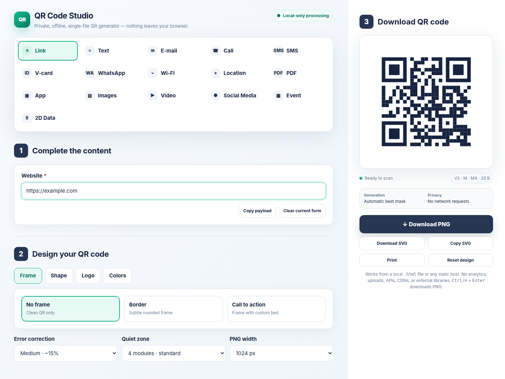

# QR Code Studio

A privacy-first, offline QR code generator that ships as **one standalone HTML file** while keeping a maintainable source tree for development.

No cloud service, analytics, CDN, API call, account, or runtime dependency is required. Open `index.html` directly in a modern browser and generate QR codes locally.



## Highlights

- **Single-file distribution** — `index.html` contains the complete UI, QR encoder, styles, and export logic.
- **Private by design** — content and uploaded logos stay in the browser; the app intentionally has no network code.
- **QR Model 2, versions 1–40** with Low / Medium / Quartile / High error correction.
- **Automatic mode optimization** for numeric, alphanumeric, and byte payloads to keep symbols compact.
- **Automatic best-mask selection** across all 8 QR mask patterns.
- **UTF-8 support** using ECI assignment 26 when non-ASCII bytes are present.
- **Scan-safe styling** — finder, timing, alignment, and format modules stay robust while data modules can be square, rounded, or dotted.
- **Logo safety** — PNG/JPG/WebP logos are re-encoded locally to PNG, stripping metadata and limiting dimensions.
- **PNG and SVG export**, SVG clipboard copy, and print support.
- **Accessibility** — semantic landmarks, keyboard-friendly tabs, focus states, live status updates, reduced-motion support, and responsive layouts.
- **Security-oriented static page** — restrictive Content Security Policy, no-referrer policy, no external scripts/styles, and no runtime network primitives.
- **Zero npm dependencies** — Node is used only for building, testing, linting, and optional local serving.

## Supported QR content

| Type | Payload |
|---|---|
| Link | HTTP/HTTPS URL |
| Text | Plain UTF-8 text |
| E-mail | `mailto:` URI with subject/body |
| Call | `tel:` URI |
| SMS | `SMSTO:` payload |
| V-card | vCard 3.0 contact |
| WhatsApp | `wa.me` link with optional message |
| Wi-Fi | Standard `WIFI:` payload |
| Location | `geo:` URI with latitude/longitude |
| PDF | PDF URL |
| App | App Store / Play Store URL |
| Images | Image/gallery URL |
| Video | Video URL |
| Social Media | Profile/post URL |
| Event | iCalendar `VEVENT` payload |
| 2D Data | Arbitrary identifier/data text |

## Quick start

### Option 1 — open it directly

Download or clone the repository and open:

```text
index.html
```

The application works from `file://` and does not need a web server.

### Option 2 — local development server

```bash
npm run serve
```

Then open `http://localhost:8080`.

### Option 3 — Docker

```bash
docker compose up --build
```

Then open `http://localhost:8080`.

## Development

The checked-in `index.html` is generated. Edit the source files under `src/` and rebuild:

```bash
npm run build
```

Run the full quality gate:

```bash
npm run check
```

That command:

1. rebuilds the standalone artifact,
2. checks JavaScript syntax,
3. runs repository/security lint checks,
4. runs QR encoder tests, and
5. verifies the generated artifact remains dependency-free.

No `npm install` is required because the repository has no package dependencies.

## Architecture

```text
src/template.html  ─┐
src/styles.css     ─┼─> scripts/build.mjs ─> index.html
src/qr-core.js     ─┤                        standalone artifact
src/app.js         ─┘

QR content ─> payload builder ─> QR encoder ─> styled SVG ─> PNG/SVG/print
                              └─> mask scoring
```

The build step only concatenates trusted local source files. There is no bundler, transpiler, package registry lookup, or remote asset fetch.

See [ARCHITECTURE.md](ARCHITECTURE.md) for design decisions and trust boundaries.

See the [Testing Guide](docs/TESTING.md) for automated and manual release checks.

## Scan reliability

QR Code Studio intentionally favors reliability over decorative effects:

- the quiet zone defaults to the QR standard minimum of 4 modules,
- uploaded logos automatically force High error correction,
- structural QR modules remain square even with rounded/dotted data styling,
- the UI calculates foreground/background contrast and warns about risky designs,
- logo size is constrained to 12–24%, and
- mask selection evaluates all eight legal masks and picks the lowest-penalty result.

For mission-critical printed QR codes, always test the final physical print with multiple camera/scanner apps before deployment.

## Privacy model

The browser receives no code from third parties and sends no QR content anywhere. The application does not contain `fetch`, `XMLHttpRequest`, WebSocket, EventSource, or analytics integrations.

Only **design preferences** (colors, shape, frame, error correction, export size) may be stored in `localStorage`. QR payload content and uploaded logo data are not persisted by the application.

## Security

Please report security issues privately as described in [SECURITY.md](SECURITY.md).

Important design choices include:

- restrictive CSP with `connect-src 'none'`,
- no external script or stylesheet references,
- no SVG logo uploads; raster logos are decoded and re-encoded locally,
- output text is escaped before inclusion in SVG/XML,
- URL payloads are limited to HTTP/HTTPS for URL-based QR types, and
- generated HTML can be reproduced from source with `npm run build`.

## Repository layout

```text
.
├── index.html                 # Generated standalone application
├── src/
│   ├── template.html          # Accessible application markup
│   ├── styles.css             # Responsive/print styles
│   ├── qr-core.js             # QR Model 2 encoder
│   └── app.js                 # Payload, UI, validation, export logic
├── scripts/
│   ├── build.mjs              # Builds standalone index.html
│   ├── lint.mjs               # Dependency-free repository checks
│   └── serve.mjs              # Tiny local static server
├── test/                      # Node built-in tests
├── .github/                   # CI, issue templates, PR template
├── ARCHITECTURE.md
├── CONTRIBUTING.md
├── SECURITY.md
├── CHANGELOG.md
├── NOTICE.md
└── LICENSE
```

## CI and releases

GitHub Actions validates the source and standalone artifact on pushes and pull requests. Every push to `main` (or `master`) automatically builds, verifies, and deploys the standalone `index.html` to GitHub Pages; the Pages workflow can also be started manually from the Actions tab. Tagged releases publish a small distribution archive containing `index.html`, license, notice, and README.

### Enable automatic GitHub Pages deployment

After pushing this repository to GitHub, open **Settings → Pages** and set **Source** to **GitHub Actions**. Do not select "Deploy from a branch" when using the included Pages workflow. Leave **Custom domain** empty unless you own and have configured a real DNS domain such as `qr.example.com`.

The deployment workflow is `.github/workflows/pages.yml`. It runs `npm run check`, packages the generated standalone application as a Pages artifact, and deploys it to the protected `github-pages` environment.

## Browser support

The app targets current versions of Chrome/Chromium, Edge, Firefox, and Safari. It uses standard browser APIs such as `TextEncoder`, Canvas, Blob URLs, FileReader, and localStorage.

## License and attribution

This repository is licensed under the MIT License. The QR encoding structure/constants are adapted from Project Nayuki's QR Code generator; the upstream MIT attribution is preserved in [NOTICE.md](NOTICE.md).
