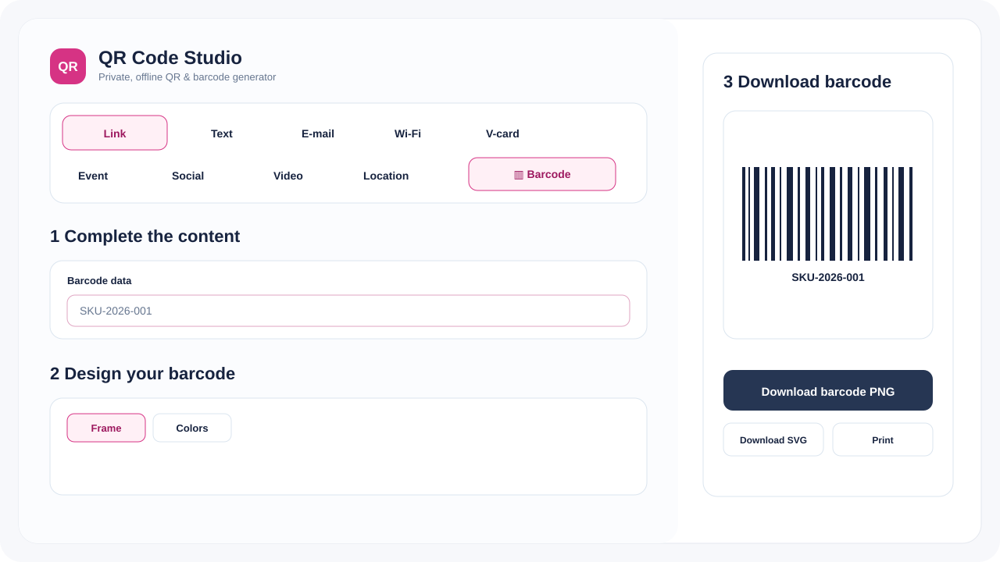

# QR Code Studio

A privacy-first, offline **QR code and barcode generator** that ships as one standalone HTML file while keeping a maintainable source tree for development.

No cloud service, analytics, CDN, API call, account, or runtime dependency is required. Open `index.html` directly in a modern browser and generate QR codes or Code 128 barcodes locally.



## Highlights

- **Single-file distribution** — `index.html` contains the complete UI, QR encoder, Code 128 encoder, styles, and export logic.
- **Private by design** — content and uploaded logos stay in the browser; the app intentionally has no network code.
- **Native Code 128-B barcodes** — the Barcode mode produces real linear barcodes instead of routing barcode data through the QR encoder.
- **QR Model 2, versions 1–40** with Low / Medium / Quartile / High error correction.
- **Automatic mode optimization** for numeric, alphanumeric, and byte QR payloads.
- **Automatic best-mask selection** across all 8 QR mask patterns.
- **UTF-8 QR support** using ECI assignment 26 when non-ASCII bytes are present.
- **Pink professional visual identity** with accessible focus states and high-contrast controls.
- **Scan-safe QR styling** — structural modules stay robust while data modules can be square, rounded, or dotted.
- **Barcode-aware UI** — QR-only controls such as ECC, shape, and logo settings are hidden while Barcode mode is active.
- **Logo safety** — PNG/JPG/WebP logos are re-encoded locally to PNG, stripping metadata and limiting dimensions.
- **PNG and SVG export**, SVG clipboard copy, print support, and keyboard shortcuts.
- **Accessibility** — semantic landmarks, keyboard-friendly tabs, focus states, live status updates, reduced-motion support, and responsive layouts.
- **Security-oriented static page** — restrictive Content Security Policy, no-referrer policy, no external scripts/styles, and no runtime network primitives.
- **Zero npm dependencies** — Node is used only for building, testing, linting, and optional local serving.

## Supported generators

### QR content

| Type | Payload |
|---|---|
| Link | HTTP/HTTPS URL |
| Text | Plain UTF-8 text |
| E-mail | `mailto:` URI with subject/body |
| Call | `tel:` URI |
| SMS | `SMSTO:` payload |
| V-card | vCard 3.0 contact |
| WhatsApp | `wa.me` link with optional message |
| Wi-Fi | Standard `WIFI:` payload |
| Location | `geo:` URI with latitude/longitude |
| PDF | PDF URL |
| App | App Store / Play Store URL |
| Images | Image/gallery URL |
| Video | Video URL |
| Social Media | Profile/post URL |
| Event | iCalendar `VEVENT` payload |

### Barcode

| Type | Symbology | Input |
|---|---|---|
| Barcode | Code 128-B | Printable ASCII (`space` through `~`), up to 120 characters |

Barcode mode renders a genuine linear Code 128 symbol with checksum, quiet zones, human-readable text, PNG/SVG export, print support, and contrast validation. It does **not** create a QR code.

See [docs/BARCODE.md](docs/BARCODE.md) for implementation and scanning notes.

## Quick start

### Option 1 — open it directly

Download or clone the repository and open:

```text
index.html
```

The application works from `file://` and does not need a web server.

### Option 2 — local development server

```bash
npm run serve
```

Then open `http://localhost:8080`.

### Option 3 — Docker

```bash
docker compose up --build
```

Then open `http://localhost:8080`.

## Development

The checked-in `index.html` is generated. Edit the source files under `src/` and rebuild:

```bash
npm run build
```

Run the full quality gate:

```bash
npm run check
```

That command:

1. rebuilds the standalone artifact,
2. checks QR, barcode, and application JavaScript syntax,
3. runs repository/security lint checks,
4. runs QR encoder tests,
5. runs Code 128 encoder/checksum/SVG tests, and
6. verifies the generated artifact remains dependency-free.

No `npm install` is required because the repository has no package dependencies.

## Architecture

```text
src/template.html      ─┐
src/styles.css         ─┤
src/theme-pink.css     ─┤
src/qr-core.js         ─┼─> scripts/build.mjs ─> index.html
src/barcode-core.js    ─┤                        standalone artifact
src/app.js             ─┤
src/enhancements.js    ─┘

QR content      ─> payload builder ─> QR encoder ───────> styled SVG ─> PNG/SVG/print
                                    └> mask scoring
Barcode content ────────────────────> Code 128 encoder ─> linear SVG ─> PNG/SVG/print
```

The build step only concatenates trusted local source files. There is no bundler, transpiler, package registry lookup, or remote asset fetch.

See [ARCHITECTURE.md](ARCHITECTURE.md) for the core trust model and [docs/BARCODE.md](docs/BARCODE.md) for the barcode-specific design.

## Scan reliability

QR Code Studio intentionally favors reliability over decorative effects.

For QR codes:

- the quiet zone defaults to the QR standard minimum of 4 modules,
- uploaded logos automatically force High error correction,
- structural QR modules remain square even with rounded/dotted data styling,
- the UI calculates foreground/background contrast and warns about risky designs,
- logo size is constrained to 12–24%, and
- mask selection evaluates all eight legal masks and picks the lowest-penalty result.

For Code 128 barcodes:

- Start B, data, modulo-103 checksum, and stop symbols are generated locally,
- quiet zones are kept around the bars,
- human-readable text is included below the symbol,
- dark bars on a light background are recommended, and
- impractically long values are rejected before rendering.

For mission-critical printed codes, always test the final physical print with multiple camera/scanner apps or dedicated scanners before deployment.

## Privacy model

The browser receives no code from third parties and sends no QR or barcode content anywhere. The application does not contain `fetch`, `XMLHttpRequest`, WebSocket, EventSource, or analytics integrations.

Only **design preferences** may be stored in `localStorage`. QR/barcode payload content and uploaded logo data are not persisted by the application.

## Security

Please report security issues privately as described in [SECURITY.md](SECURITY.md).

Important design choices include:

- restrictive CSP with `connect-src 'none'`,
- no external script or stylesheet references,
- no SVG logo uploads; raster logos are decoded and re-encoded locally,
- output text is escaped before inclusion in SVG/XML,
- URL payloads are limited to HTTP/HTTPS for URL-based QR types,
- barcode input is validated before encoding, and
- generated HTML can be reproduced from source with `npm run build`.

## Repository layout

```text
.
├── index.html                  # Generated standalone application
├── src/
│   ├── template.html           # Accessible application markup
│   ├── styles.css              # Base responsive/print styles
│   ├── theme-pink.css          # Pink product identity and barcode-mode layout
│   ├── qr-core.js              # QR Model 2 encoder
│   ├── barcode-core.js         # Code 128-B encoder/SVG renderer
│   ├── app.js                  # Core payload/UI/export logic
│   └── enhancements.js         # Barcode-mode integration and adaptive labels
├── scripts/
│   ├── build.mjs               # Builds standalone index.html
│   ├── lint.mjs                # Dependency-free repository checks
│   └── serve.mjs               # Tiny local static server
├── test/
│   ├── qr-core.test.mjs
│   ├── barcode-core.test.mjs
│   └── repository.test.mjs
├── docs/
│   ├── BARCODE.md
│   └── app-preview-pink.svg
├── .github/                    # CI, Pages deployment, issue/PR templates
├── ARCHITECTURE.md
├── CONTRIBUTING.md
├── SECURITY.md
├── CHANGELOG.md
├── NOTICE.md
└── LICENSE
```

## CI, Pages, and releases

GitHub Actions validates the source and standalone artifact on pushes and pull requests. Every push to `main` automatically builds, verifies, and deploys the generated `index.html` to GitHub Pages. The Pages workflow can also be started manually from the Actions tab.

To enable automatic deployment, open **Settings → Pages** and set **Source** to **GitHub Actions**. Leave **Custom domain** empty unless a real DNS domain has been configured.

The Pages workflow runs `npm run check` before deployment, so a broken QR encoder, barcode encoder, standalone build, syntax check, or repository security check blocks publication.

## Browser support

The app targets current versions of Chrome/Chromium, Edge, Firefox, and Safari. It uses standard browser APIs such as `TextEncoder`, Canvas, Blob URLs, FileReader, and localStorage.

## License and attribution

This repository is licensed under the MIT License. The QR encoding structure/constants are adapted from Project Nayuki's QR Code generator; the upstream MIT attribution is preserved in [NOTICE.md](NOTICE.md). The Code 128 implementation in this repository is dependency-free and implemented directly from the Code 128 symbol rules/pattern table.
